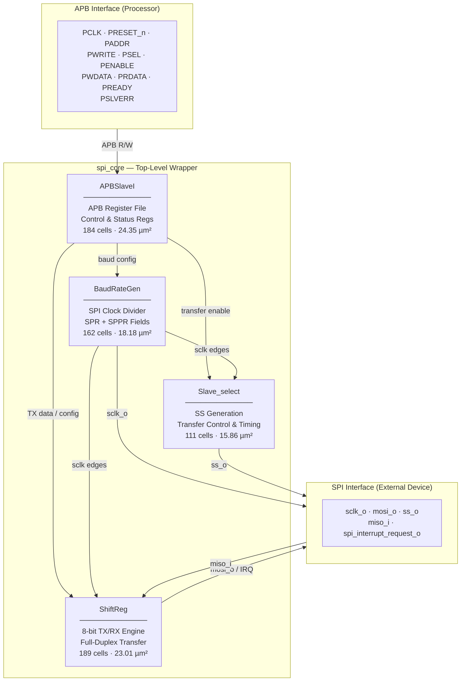
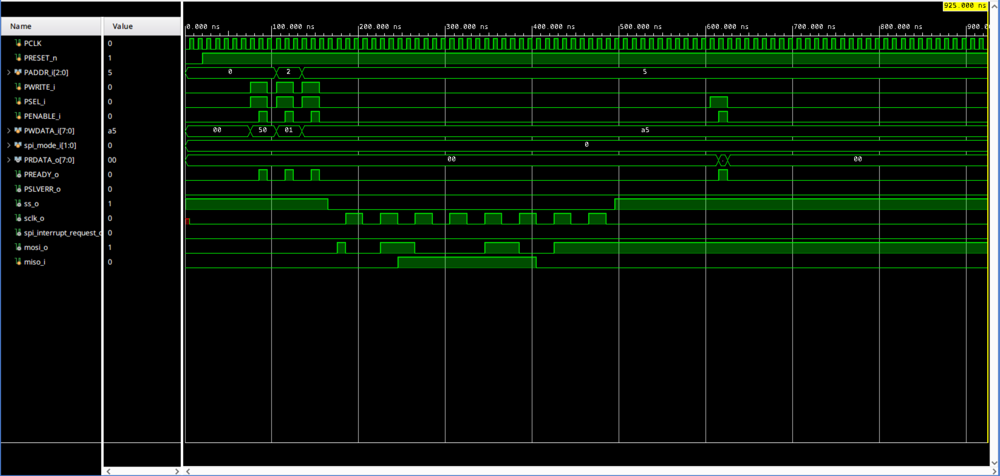
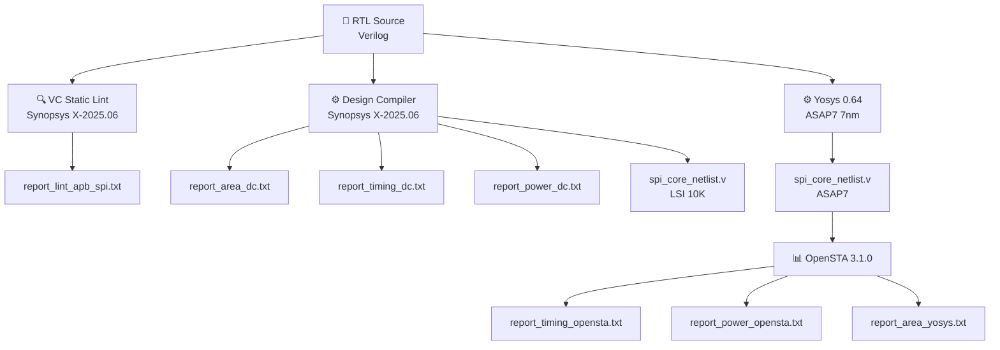
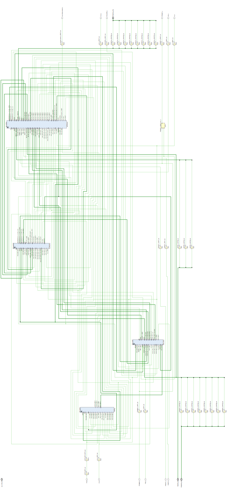

<div align="center">

# APB SPI Core — 7nm ASAP7 Implementation

**A fully functional SPI Master controller with APB slave interface,**  
**synthesized and verified on the ASAP7 7nm predictive process node.**

<br/>

[](https://en.wikipedia.org/wiki/Verilog)
[](https://github.com/The-OpenROAD-Project/asap7)
[](#timing-analysis)
[](#lint-summary)
[](LICENSE)
[](https://github.com/QubitCrafter)

</div>

---

## What is this?

This project implements a complete **SPI (Serial Peripheral Interface) Master Controller** that communicates with a processor through an **APB (Advanced Peripheral Bus) slave interface**. In simple terms — it's a chip-level communication block that lets a processor talk to external devices like sensors, displays, and memory chips using the SPI protocol.

The design was written in Verilog RTL, verified with a testbench, linted using Synopsys VC Static, synthesized using both **Synopsys Design Compiler** (industry standard) and **Yosys** (open source), and analyzed for timing, power, and area on the **ASAP7 7nm academic PDK** — the same process node used in cutting-edge research for next-generation chip design.

---

## Table of Contents

- [Features](#features)
- [Architecture](#architecture)
- [Port Description](#port-description)
- [Project Structure](#project-structure)
- [Simulation Results](#simulation-results)
- [Synthesis Results](#synthesis-results)
- [Timing Analysis](#timing-analysis)
- [Power Analysis](#power-analysis)
- [Tool Flow](#tool-flow)
- [How to Run](#how-to-run)
- [Dependencies](#dependencies)
- [Lint Summary](#lint-summary)
- [Schematic](#schematic)
- [Author](#author)
- [License](#license)

---

## Features

| Feature | Detail |
|---|---|
| SPI Master operation | Configurable CPOL and CPHA (all 4 SPI modes) |
| APB Slave Interface | Full read/write register access for processor |
| Configurable baud rate | SPR\[2:0\] and SPPR\[2:0\] — wide frequency range |
| Data width | 8-bit, MSB-first and LSB-first (LSBFE) modes |
| Slave Select | Automatic assertion/deassertion with transfer sequencing |
| Interrupt output | `spi_interrupt_request_o` — signals transfer complete |
| SPI Wait mode | SPISWAI halts SPI clock in low-power states |
| Master/Slave selection | Configurable via control register |
| Reset | Active-low asynchronous reset (`PRESET_n`) |
| Synthesis result | **646 cells** on ASAP7 7nm, estimated max **243 MHz** |
| Verification | Zero lint errors · Zero setup/hold violations at 50 MHz |

---

## Architecture

The design is split into four submodules, each with a clear responsibility:



**Module summary:**

| Module | Cells | Area (µm²) | Sequential % | Description |
|:---|:---:|:---:|:---:|:---|
| `APBSlaveI` | 184 | 24.35 | 59.2% | APB register file, control/status registers |
| `ShiftReg` | 189 | 23.01 | 47.8% | 8-bit TX/RX shift register engine |
| `BaudRateGen` | 162 | 18.18 | 35.5% | SPI clock divider and edge detection |
| `Slave_select` | 111 | 15.86 | 43.0% | SS generation and transfer sequencing |
| **spi_core (total)** | **646** | **81.40** | **47.5%** | Full SPI master with APB interface |

---

## Port Description

### APB Interface (Processor Side)

| Port | Direction | Width | Description |
|:---|:---:|:---:|:---|
| `PCLK` | Input | 1 | APB clock — all registers sync to this |
| `PRESET_n` | Input | 1 | Active-low asynchronous reset |
| `PADDR_i` | Input | 3 | Register address (selects which SPI register) |
| `PWRITE_i` | Input | 1 | Write enable (1 = write, 0 = read) |
| `PSEL_i` | Input | 1 | Peripheral select from APB master |
| `PENABLE_i` | Input | 1 | Enable phase of APB transfer |
| `PWDATA_i` | Input | 8 | Write data from processor |
| `PRDATA_o` | Output | 8 | Read data back to processor |
| `PREADY_o` | Output | 1 | Transfer complete acknowledgment |
| `PSLVERR_o` | Output | 1 | Slave error flag (asserted during active transfer) |

### SPI Interface (Device Side)

| Port | Direction | Width | Description |
|:---|:---:|:---:|:---|
| `sclk_o` | Output | 1 | SPI clock to external device |
| `mosi_o` | Output | 1 | Master Out Slave In — data to device |
| `miso_i` | Input | 1 | Master In Slave Out — data from device |
| `ss_o` | Output | 1 | Slave Select (active low) |

### Control / Status

| Port | Direction | Width | Description |
|:---|:---:|:---:|:---|
| `spi_mode_i` | Input | 2 | SPI operating mode selection |
| `spi_interrupt_request_o` | Output | 1 | Transfer complete interrupt to processor |

---

## Project Structure

```
SPI_Project/
│
├── README.md
│
├── rtl/                          # Synthesizable RTL source files
│   ├── spi_core.v                # Top-level module
│   ├── APBSlaveI.v               # APB slave interface & register file
│   ├── BaudRateGen.v             # SPI clock generator
│   ├── ShiftReg.v                # 8-bit TX/RX shift register
│   └── Slave_select.v            # Slave select & transfer control
│
├── tb/                           # Testbenches
│   ├── spi_core_tb.v             # Top-level testbench
│   ├── APBSlaveI_tb.v            # APB interface testbench
│   ├── BaudRateGen_tb.v          # Baud rate generator testbench
│   ├── ShiftReg_tb.v             # Shift register testbench
│   └── Slave_select_tb.v         # Slave select testbench
│
├── synth/                        # Synthesis scripts and outputs
│   ├── synth_asap7.ys            # Yosys synthesis script (ASAP7 7nm)
│   ├── api_spi_synth_DC.tcl      # Synopsys Design Compiler script
│   ├── spi_constraints.con       # Timing constraints (SDC format)
│   └── spi_core_netlist.v        # Gate-level netlist (Yosys + ASAP7)
│
├── sta/                          # Static Timing Analysis
│   └── sta_timing.tcl            # OpenSTA timing script
│
├── lint/                         # Lint checking
│   └── api_spi_lint_VC.tcl       # Synopsys VC Static lint script
│
├── lib/                          # Cell libraries
│   ├── asap7_merged_RVT_TT.lib   # Merged ASAP7 7nm liberty (202 cells, TT corner)
│   └── lsi_10k.db                # Synopsys LSI 10K library (Design Compiler)
│
├── reports/                      # All analysis reports
│   ├── report_area_dc.txt        # Area — Design Compiler
│   ├── report_area_yosys.txt     # Area — Yosys + OpenSTA (ASAP7)
│   ├── report_power_dc.txt       # Power — Design Compiler
│   ├── report_power_opensta.txt  # Power — OpenSTA (ASAP7)
│   ├── report_timing_dc.txt      # Timing — Design Compiler
│   ├── report_timing_opensta.txt # Timing — OpenSTA (ASAP7)
│   └── report_lint_apb_spi.txt   # Lint report — VC Static
│
└── docs/
    ├── schematics/
    │   └── spi_schematic.svg     # Gate-level schematic (Vivado export)
    └── waveforms/
        ├── spi_core_waveforms.png  # Simulation waveform screenshot
        └── spi_core_tb_behav.wcfg  # Vivado waveform config (load in simulator)
```

---

## Simulation Results

The testbench exercises a full SPI transaction sequence including APB register writes to configure the SPI controller, data transmission, and readback.



**What the waveform shows:**

| Signal | Observed Behaviour |
|:---|:---|
| `PCLK` | Running at target frequency |
| `PRESET_n` | Deasserts after reset — all outputs initialize correctly |
| APB handshake | `PWRITE_i → PSEL_i → PENABLE_i → PREADY_o` sequence |
| `PWDATA_i` | `0x50` (baud config) and `0x01` (control reg) written |
| `ss_o` | Asserts low — SPI transfer begins |
| `sclk_o` | Correct SPI clock generated |
| `mosi_o` | Data bits shifting out serially |
| `miso_i` | Data received simultaneously (full duplex) |
| Transfer complete | `ss_o` deasserts, interrupt fires |

To load the waveform configuration in Vivado:
```
File → Load Configuration → docs/waveforms/spi_core_tb_behav.wcfg
```

---

## Synthesis Results

Two independent synthesis flows were run for cross-validation:

### Flow 1 — Synopsys Design Compiler + LSI 10K Library

| Metric | Value |
|:---|:---|
| Total cells | 789 |
| Combinational cells | 687 |
| Sequential cells | 102 |
| Buf/Inv | 90 |
| Total cell area | 2110.0 (library units) |
| Tool | Design Compiler X-2025.06 |

### Flow 2 — Yosys + OpenSTA + ASAP7 7nm Library

| Metric | Value |
|:---|:---|
| Total cells | 646 |
| Combinational cells | 544 |
| Sequential cells | 102 |
| Buf/Inv | 64 |
| Total cell area | **81.40 µm²** |
| Combinational area | 42.73 µm² |
| Sequential area | 38.67 µm² |
| Tool | Yosys 0.64 + OpenSTA 3.1.0 |
| Library | ASAP7 RVT TT @ 0.7V, 25°C |

> Both flows produce identical sequential cell counts (102 flip-flops), confirming consistent register inference across tools.

---

## Timing Analysis

**Target clock:** 50 MHz (20 ns period) — typical for an SPI controller in an embedded SoC.

### Design Compiler Results (LSI 10K)

| Metric | Value |
|:---|:---|
| Critical path | 18.64 ns |
| Clock period | 20.00 ns |
| Setup slack | **+0.01 ns ✅ MET** |
| Critical path | `SPI_BR_reg[0] → mosi_send_sclk0_o_reg` |

### OpenSTA Results (ASAP7 7nm)

| Metric | Value |
|:---|:---|
| Critical path delay | **4.11 ns** |
| Worst Setup Slack (WNS) | **+11.84 ns ✅ MET** |
| Total Negative Slack (TNS) | **0.0 ps** |
| Worst Hold Slack | **+34.6 ps ✅ MET** |
| Setup violations | **0** |
| Hold violations | **0** |
| Estimated max frequency | **243.2 MHz** |

The design comfortably meets the 50 MHz target on ASAP7 7nm with 11.84 ns of positive slack, meaning it could theoretically be pushed to **243 MHz** before timing closure would be needed. This is expected — the ASAP7 7nm node is significantly faster than older libraries, and an SPI controller is not a compute-intensive design.

> **Note:** Timing was analyzed with an ideal clock tree (no clock network delay modeled). Real implementation with clock tree synthesis would reduce the slack margin slightly.

---

## Power Analysis

### Design Compiler Results (LSI 10K)

| Type | Power |
|:---|:---|
| Net switching power | 1.07 µW |
| Cell internal power | 0.0 nW |
| Total dynamic power | **1.07 µW** |

> The LSI 10K library does not characterize internal or leakage power, so only switching power is reported.

### OpenSTA Results (ASAP7 7nm @ 0.7V, 25°C)

| Type | Power | % |
|:---|:---|:---:|
| Internal power | 7.32 µW | 15.0% |
| Switching power | 0.0 W | 0.0%* |
| Leakage power | 41.4 µW | 85.0% |
| **Total power** | **48.7 µW** | 100% |

**Per-module breakdown:**

| Module | Internal (W) | Leakage (W) | Total (W) |
|:---|:---:|:---:|:---:|
| APBSlaveI | 2.08e-06 | 1.44e-05 | 1.65e-05 |
| BaudRateGen | 1.73e-06 | 1.18e-05 | 1.36e-05 |
| ShiftReg | 2.30e-06 | 1.10e-05 | 1.33e-05 |
| Slave_select | 1.21e-06 | 6.82e-06 | 8.03e-06 |
| **Total** | **7.32e-06** | **4.14e-05** | **4.87e-05** |

> \*Switching power is 0 because no VCD/SAIF activity file was provided. Real dynamic power during active SPI transfers will be higher. Leakage dominates at 85% — typical for static analysis without activity annotation on a 7nm node at 0.7V.

---

## Tool Flow



---

## How to Run

### Prerequisites

| Tool | Version | Purpose |
|:---|:---:|:---|
| Yosys | 0.64+ | Open-source synthesis |
| OpenSTA | 3.1.0+ | Static timing & power analysis |
| Synopsys Design Compiler | X-2025.06 | RTL synthesis (industry flow) |
| Synopsys VC Static | X-2025.06 | RTL lint checking |
| Vivado | 2025.2 | Simulation & schematic |
| OSS CAD Suite | 2026 | Open-source EDA environment |

### Lint Check (Synopsys VC Static)
```bash
cd lint/
dc_shell -f api_spi_lint_VC.tcl
```

### Synthesis — Yosys (ASAP7 7nm)
```bash
cd synth/
yosys synth_asap7.ys
```

### Synthesis — Design Compiler
```bash
cd synth/
dc_shell -f api_spi_synth_DC.tcl
```

### Static Timing Analysis — OpenSTA
```bash
cd sta/
sta -exit sta_timing.tcl | tee timing_report.txt
```

### Simulation — Vivado
1. Create a new Vivado project
2. Add all files from `rtl/` as design sources
3. Add the relevant file from `tb/` as simulation source
4. Run behavioral simulation
5. Load `docs/waveforms/spi_core_tb_behav.wcfg` to restore signal view

---

## Dependencies

### ASAP7 PDK Library

The `lib/asap7_merged_RVT_TT.lib` file in this repo is a **custom merged library** created by combining 15 individual liberty files from the ASAP7 7nm PDK into a single unified file for a simplified EDA flow. It contains 202 cell types at the RVT (Regular Voltage Threshold), TT (Typical-Typical) corner at 0.7V, 25°C.

Original PDK source: [ASAP7 — Arizona State Predictive PDK](https://github.com/The-OpenROAD-Project/asap7)

### Tools Used

| Tool | Version | Purpose |
|:---|:---:|:---|
| Synopsys Design Compiler | X-2025.06 | RTL synthesis (industry) |
| Synopsys VC Static | X-2025.06 | RTL lint checking |
| Yosys | 0.64+172 | Open-source synthesis |
| OpenSTA | 3.1.0 | Static timing & power analysis |
| Vivado | 2025.2 | Simulation & schematic |
| OSS CAD Suite | 2026 | Open-source EDA environment |

---

## Lint Summary

Lint was run using **Synopsys VC Static** with goal `lint_rtl`.

| Severity | Count | Status |
|:---|:---:|:---:|
| Fatals | 0 | ✅ Clean |
| Errors | 0 | ✅ Clean |
| Warnings | 3 | ⚠️ Reviewed |
| Infos | 18 | ℹ️ Informational |

**Warnings explained:**

- `W240` — `spi_mode_i[1:0]` declared in `APBSlaveI` but not read internally. This input is passed through to submodules at the `spi_core` level and is intentionally unused inside `APBSlaveI` directly. **Waived.**
- `COM_OPT009/010` — `search_path` and `link_library` not set in the lint TCL script. These are tool setup warnings, not RTL issues. **Not applicable to RTL quality.**

No functional RTL errors or warnings. Design is lint clean.

---

## Schematic

Gate-level schematic generated from Vivado RTL elaboration:



---

## Author

<div align="center">

**Utkarsh** · [@QubitCrafter](https://github.com/QubitCrafter)

*Designed, implemented, verified, synthesized, and analyzed this APB SPI core end-to-end as a complete VLSI/RTL design project — from Verilog RTL through lint, simulation, synthesis (Yosys + Design Compiler), and static timing/power analysis on the ASAP7 7nm PDK.*

</div>

---

## License

This project is released under the **MIT License**. See [LICENSE](LICENSE) for the full license text.

```
Copyright (c) 2026 Utkarsh (QubitCrafter)
```

> **Third-party components:**
> - The **ASAP7 PDK** is developed by Arizona State University and is subject to its own licensing terms. See [ASAP7 on GitHub](https://github.com/The-OpenROAD-Project/asap7).
> - The **`lsi_10k.db`** library is a Synopsys educational library and is subject to Synopsys license terms.
